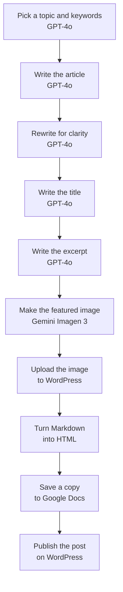

# AI blog pipeline

Writes and publishes a blog post from start to finish with nobody touching it. It's set to run about every 10 hours.

## How it works

1. Topic. GPT-4o picks one topic and a few seed keywords for the category. The prompt points it at the blog so it doesn't repeat something already written, and lists subjects to stay away from.
2. Draft. A second call writes the article in Markdown from that topic and those keywords, with at least one outside source linked.
3. Rewrite. A third call edits the draft for clarity. The prompt has a list of hype phrases to avoid and plain versions to use instead.
4. Title and excerpt. Two short calls, one for each.
5. Image. Gemini makes a square featured image with no text on it.
6. Publish. Make turns the Markdown into HTML, uploads the image to the WordPress media library, and publishes the post with its title, excerpt and image. A copy of the article goes to Google Docs.

## Why it's five AI steps

Each OpenAI step does one thing and hands its result to the next. When a post comes out wrong, it's easy to tell which step did it and fix that one prompt.

## Four copies

I built four of these, one per blog category: life, money, reviews and tech. Only the topic prompt changes. This is the tech one.

## Setup

1. Import `blueprint.json` and connect OpenAI, Gemini, WordPress and Google.
2. In the first prompt, change `https://YOUR-BLOG.example/` to your blog, then edit the category and the list of topics to avoid.
3. In the last module, set your own WordPress author and category.

## Things to know

The prompts tell the model to write only true information, but nothing in the flow checks the facts. If accuracy matters, change the post status in the last module from publish to draft and read it before it goes live.
