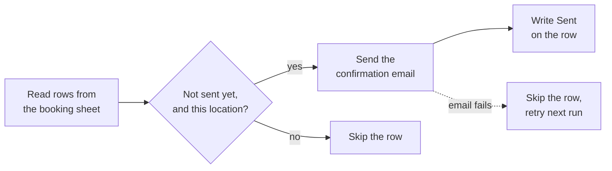

# Booking confirmations

Sends a confirmation email for every new booking in a Google Sheet.

I built this for a call center team. Confirmations were going out by hand, and with several people working the same sheet, customers sometimes got the same email twice.

## How it works

It runs every 30 minutes.

1. Reads every row in the sheet that has a first name.
2. Keeps the rows where the status column doesn't say Sent and the location matches this scenario's city.
3. Sends the email with the customer's name, day and time filled in.
4. Writes Sent in the status column for that row.

## Why the Sent column matters

The scenario checks that column before it sends and writes to it after. A row can't get a second email, no matter how many times the scenario runs.

If an email fails, the error handler drops that row before it gets marked. The next run picks it up again.

It also means anyone on the team can open the sheet and see what has gone out.

## Sheet layout

| Column | What's in it |
|---|---|
| A | First name |
| C | Email address |
| J | Location, written as City, ST |
| K | Day of the appointment |
| L | Time of the appointment |
| W | Status. The scenario writes Sent here. |

## One scenario per location

Each location gets its own copy of this scenario, with its own venue name and address in the email. To add a location, clone the scenario, change the location in the filter, and change the venue block in the email.

## Setup

1. Import `blueprint.json` and connect Google Sheets and Gmail.
2. Put your spreadsheet ID in the first and last modules, in place of `YOUR_SPREADSHEET_ID`.
3. Change `YOUR CITY, ST` in the filter on the email module.
4. Edit the email HTML: company name, venue, phone number and sign-off.
