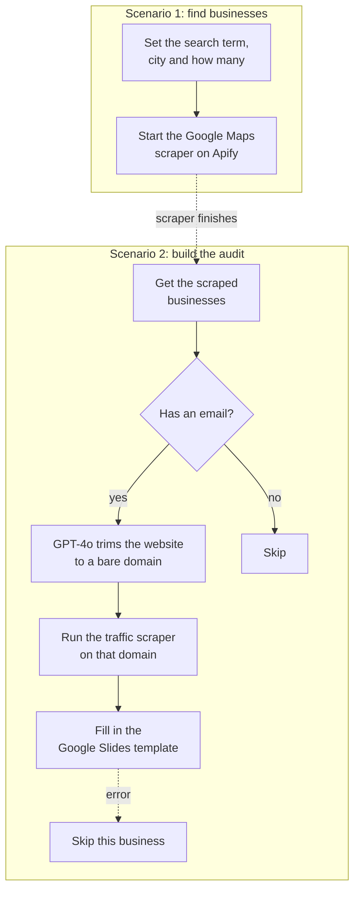

# Lead audit builder

Give it a type of business and a city. It finds those businesses on Google Maps, looks up each one's website traffic, and fills in a marketing audit slide deck with their numbers.

It's two scenarios joined by an Apify webhook.

## How it works

## Why it's two scenarios

The Google Maps scrape takes a minute or so. The first scenario starts it and ends. Apify calls the second scenario when the scrape is done, so nothing sits there waiting on it.

## Where the AI is

One small step. The Maps scraper returns full addresses like `https://www.example.com/?ref=maps`, and the traffic scraper wants `example.com`. GPT-4o does that cleanup, with three examples in the prompt and a 100 token cap.

## The slide template

The audit is a Google Slides deck with 20 placeholder words in it, like `company_name`, `global_rank` and `top_keywords_1`. Make copies the deck for each business and swaps the placeholders for that business's numbers.

The template isn't in this repo. Any deck with those words in it will work, and the full list is in the last module of the second blueprint.

## Setup

1. Import both blueprints and connect Apify, OpenAI and Google.
2. The scrapers are two public Apify actors: Google Maps Email Extractor (`lukaskrivka/google-maps-with-contact-details`) and Similarweb Advanced Scraper (`curious_coder/similarweb-advanced-scraper`).
3. In the second scenario, create the Apify webhook on the first module so it fires when the Google Maps actor finishes a run.
4. Put your Slides template ID in the last module, in place of `YOUR_SLIDES_TEMPLATE_ID`.
5. Set the search term, city and count in the first scenario and run it.

## Things to know

Small local businesses often have little or no traffic data, so some decks come back with blanks.

Only businesses with an email address on their listing get an audit.
